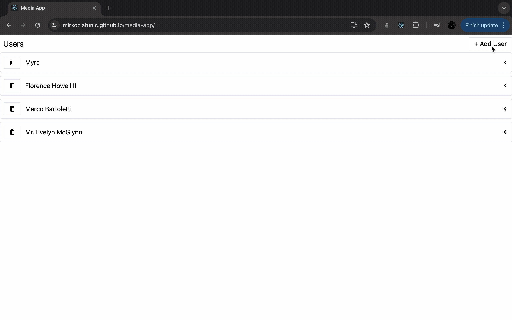

<h1>Media App</h1>

## 📋 <a name="table">Table of Contents</a>

1. 🤖 [Introduction](#introduction)
2. ⚙️ [Tech Stack](#tech-stack)
3. 🔋 [Link to Page](#link-page)
4. 🛠️ [Improvements Ideas](#improvements)

## <a name="introduction">🤖 Introduction</a>

The driving force behind creating this application is to empower the generation of random users, albums, and photos.

In pursuit of this objective, I embraced the capabilities of ReactJS and Redux to construct the application, while embracing the sleek aesthetics of TailwindCSS and interfacing with APIs using async thunks and Redux Toolkit Queries.

## <a name="tech-stack">⚙️ Tech Stack</a>

- HTML
- Tailwind CSS
- ReactJS
- Redux
- Redux Toolkit Query

## <a name="link-page">🔋 Link to Page</a>

- Live Site URL: [GitHub Page](https://mirkozlatunic.github.io/media-app/)

## <a name="improvements">🛠️ Improvements Ideas</a>

- Able to switch between dark and light mode
